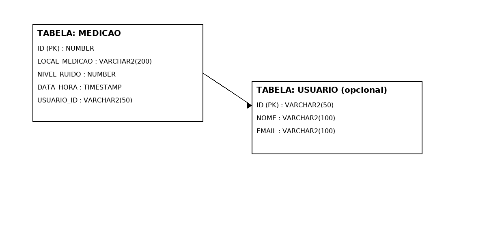
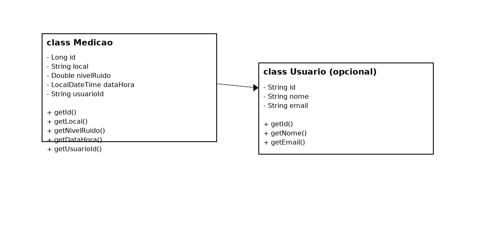

# NoiseMap - Mapeamento Colaborativo de Poluição Sonora Urbana

**Descrição curta:** Backend Java Spring Boot para o projeto NoiseMap — gerencia medições de poluição sonora (entidade `Medicao`) e fornece API REST com HATEOAS.

## O que foi alterado nesta versão
- Entidade `Medicao` criada (LOCAL, NIVEL_RUIDO, DATA_HORA, USUARIO_ID) e mapeada para Oracle com `SEQ_MEDICAO`.
- Endpoints REST em `/api/medicoes` com HATEOAS (EntityModel / CollectionModel).
- Postman collection atualizada para testar endpoints de medição.
- README, cronograma e CHANGELOG ajustados para o domínio NoiseMap.

## Como rodar
1. Configure `backend/src/main/resources/application.yml` com os dados do Oracle (HOST, SERVICE_NAME, usuário, senha).
2. Garanta que exista a sequence no Oracle:
   ```sql
   CREATE SEQUENCE SEQ_MEDICAO START WITH 1 INCREMENT BY 1;
   ```
3. Na pasta `backend`:
   ```bash
   mvn clean package
   java -jar target/backend-0.0.1-SNAPSHOT.jar
   ```
4. Importar `docs/postman_collection.json` no Postman e testar os endpoints.

## Endpoints principais
- `GET /api/medicoes` — lista (retorna HATEOAS links)
- `GET /api/medicoes/{id}` — detalhes (com links)
- `POST /api/medicoes` — cria medição
- `PUT /api/medicoes/{id}` — atualiza medição
- `DELETE /api/medicoes/{id}` — deleta medição
- `GET /api/medicoes/usuario/{usuarioId}` — lista medições por usuário

## Notas
- A autenticação não foi implementada nessa versão; `usuarioId` é um campo livre para associar medições a usuários.

## Integrantes
- Otoniel Arantes Barbado — RM 560112 — Backend (Entidades, JPA, HATEOAS)
- Rafael Terra Teodoro — RM 560955 — Backend (Serviços e Testes)
- Enzo Elia Tarraga — RM 560901 — Documentação e Visualização

## Link do vídeo de apresentação
- https://youtu.be/2iaouPDkuXM

## Diagramas (DER e Diagrama de Classes)
As imagens dos diagramas estão em `/docs/DER.png` e `/docs/class-diagram.png`.





